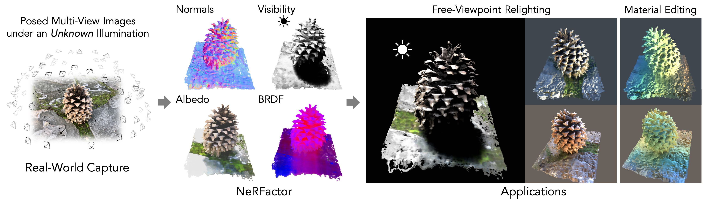

# NeRFactor

[[Paper]](https://arxiv.org/pdf/2106.01970.pdf)
[[Video]](https://www.youtube.com/watch?v=UUVSPJlwhPg)
[[Project]](https://xiuming.info/projects/nerfactor/)



This is the authors' code release for:
> **NeRFactor: Neural Factorization of Shape and Reflectance Under an Unknown Illumination**  
> Xiuming Zhang, Pratul P. Srinivasan, Boyang Deng, Paul Debevec, William T. Freeman, Jonathan T. Barron  
> **TOG 2021 (Proc. SIGGRAPH Asia)**

This is not an officially supported Google product.


## Setup

1. Clone this repository:
    ```bash
    git clone https://github.com/google/nerfactor.git
    ```

1. Install a Conda environment with all dependencies:
    ```bash
    cd nerfactor
    conda env create -f environment.yml
    conda activate nerfactor
    ```

Tips:
* You can find the TensorFlow, cuDNN, and CUDA versions in `environment.yml`.
* The IPython dependency in `environment.yml` is for `IPython.embed()` alone.
  If you are not using that to insert breakpoints during debugging, you can
  take it out (it should not hurt to just leave it there).


## Downloads

If you are using our data, metadata, or pre-trained models
(new as of 07/17/2022), see the "Downloads" section of the
[project page](https://xiuming.info/projects/nerfactor/).

If you are BYOD'ing (bringing your own data), go to [`data_gen/`](./data_gen) to
either render your own synthetic data or process your real captures.


## Running the Code

Go to [`nerfactor/`](./nerfactor) and follow the instructions there.


## Issues or Questions?

If the issue is code-related, please open an issue here.

For questions, please also consider opening an issue as it may benefit future
reader. Otherwise, email [Xiuming Zhang](https://xiuming.info).


## Acknowledgments

This repository builds upon or draws inspirations from
[this TOG 2015 code release](https://brdf.compute.dtu.dk/),
[the NeRF repository](https://github.com/bmild/nerf), and
[the pixelNeRF repository](https://github.com/sxyu/pixel-nerf).
We thank the authors for making their code publicly available.


## Changelog

* 07/17/2022: Added the MERL BRDF model to the release of our pre-trained models.
* 04/10/2022: Released pre-trained models.
* 09/01/2021: Updates related to SIGGRAPH Asia revision.
* 06/01/2021: Initial release.
